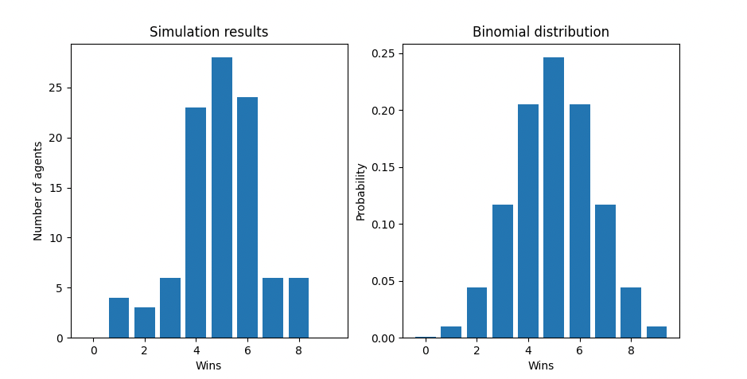

# MAC (Mongosaurus Anti Cheat) engine

This is an experiment to mathematically try to spot cheaters in a binary "game".

### Setup
All of the required dependencies is provided in the `requirements.txt` file. You can install it using

> pip install -r requirements.txt

### Running the project
I have provided a Makefile to be able to setup a test suite, run it by using
> make run-mac

### Math behind the engine
First of all we define the different boundaries for the suite to run.
* Number of agents $n_r \in \mathbb{N} = \{0, 1, 2, \ldots, \infty \}$
* Number of cheating agents $n_c \in \mathbb{N} = \{0, 1, 2, \ldots, \infty \}$ but $n_c \leq n_r$
* Number of iterations  $k \in \mathbb{N} = \{0, 1, 2, \ldots, \infty \}$
* Probability of winning $p_r = 0.5$ 
* Probability of winning as a cheater is defined as $p_c = p_r + 0.1 \implies p_c = 0.6$

First of all we run the simulations and run the simulation given the provided parameters and summarize the results and present it in a graph (see below example):

#### Simulation results:

Is just the summary of the agents results

#### Binomial distribution:

The binomial distribution describes statistically what we could expect for a result given the following underlying equation for a given situation

$$
i \in \mathbb{N} = \{0, 1, 2, \ldots, \infty \}, i \leq k
$$

$$
\binom{k}{i}p^i(1-p)^{k-i}
$$

$$
\binom{k}{i} = \frac{k!}{i!(k-i)}
$$

then the given binomial distribution can be calculated with (with our parameters)

$$
\sum_{i=0}^{[k]}\binom{k}{i}p_r^i(1-p_r)^{k-i}
$$

### Benchmark

The goals of this engine are:
* Accuse less than 5% of fair players
* Catch more than 80% of the cheaters
